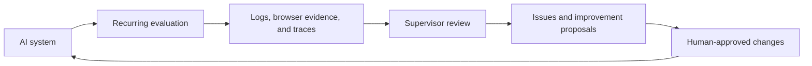

# OpenOrbit

> **The local control plane for continuously evaluating, supervising, and improving AI systems.**

OpenOrbit does not use AI merely to automate work. It automates the operating cycle around an AI system itself: evaluate it on a schedule, retain evidence, review supervisor feedback, and make its improvement history observable.

Run the control room locally, keep the operational record in your own AppData, and decide which changes deserve approval.

## Why OpenOrbit?

An AI feature can look healthy in a demo and still regress after a prompt, model, tool, or product change. OpenOrbit gives that feature a repeatable operating loop rather than a one-off test:



## What you can do

- Define reusable **evaluation builds** from a target, workflow, runner, fixed test cases, manager prompt, and AI model profile.
- Run a one-off **test** before saving a build, or run its configured lifecycle repeatedly with clear approval boundaries.
- Inspect every phase through process logs, structured evidence, browser screenshots, supervisor responses, and OpenTelemetry traces.
- Review reported issues and proposed improvements in a durable decision history.
- Observe the PDCA cycle across iterations instead of treating a single model response as the whole story.
- Stop active work from one local control room.

## Product tour

OpenOrbit is designed around the information an operator needs at each stage:

| Area | What it answers |
| --- | --- |
| **Dashboard** | Is the AI system healthy right now? What changed recently? |
| **Evaluation builds** | What exactly is being evaluated, with which assets and policy? |
| **Evaluation run detail** | What happened in each phase, and what evidence supports the result? |
| **Improvement results** | Are feedback, decisions, and scores actually improving over time? |

Screenshots of a complete English-language product scenario will live here. The scenario will follow a customer-support AI through a browser journey, supervisor review, and a proposed operating improvement.

## Quick start

### Requirements

| Requirement | Version | Used for |
| --- | --- | --- |
| Python | 3.13+ | Local API and runner SDK |
| Node.js | 24+ | Packaged launcher and frontend development |
| Git | 2.40+ recommended | Repository-backed evaluation and improvement cycles |
| Chromium system libraries | Platform-specific | Browser journeys on Linux only |

### Run the packaged app

```bash
pip install openorbit
orbit run
```

Or run it once with npm:

```bash
npx openorbit run
```

Open `http://127.0.0.1:3000`. If that port is occupied, OpenOrbit selects the next available port and prints its URL. Set `ORBIT_PORT` and `ORBIT_HOST` when you need a specific listener:

```bash
ORBIT_PORT=8787 ORBIT_HOST=0.0.0.0 orbit run
```

### Run from this repository

```bash
git clone https://github.com/forthfate/openorbit.git
cd openorbit

uv sync --extra dev
corepack enable
pnpm install
pnpm run build
pnpm run run
```

For frontend development, start the API and Vite separately:

```bash
uv run uvicorn app.main:app --app-dir backend --reload --port 3000
pnpm --filter agent-improvement-console-ui run dev
```

Then open the Vite URL shown in the terminal, normally `http://localhost:5173`.

## Your first evaluation loop

1. Create or choose an AI model profile in **Assets**.
2. Add the runner, workflow, fixed test cases, and target environment that describe the AI system you want to evaluate.
3. Create an **Evaluation build** from those assets.
4. Use **Test** to execute the build once and inspect its full run detail without adding it to the evaluation-run history.
5. Start a regular run when ready, then review evidence and supervisor results in **Evaluation runs**.
6. Use **Improvement results** to compare scores, feedback, decisions, and cycle health over time.

## Core concepts

| Concept | Meaning |
| --- | --- |
| **Asset** | A reusable model profile, runner, workflow, prompt, test set, or environment. |
| **Evaluation build** | A versioned operating configuration that connects assets to one AI-system evaluation. |
| **Test** | A transient, one-time execution used to validate an evaluation build. |
| **Run** | A retained execution record, including phases, evidence, logs, and decisions. |
| **Supervisor** | An AI review step that produces structured evaluation results, issues, and proposals. |
| **Improvement cycle** | The evidence-backed PDCA loop across multiple evaluations and human decisions. |

## Safety and local data

OpenOrbit is local-first. Operational state is stored outside the repository in platform AppData:

- Windows: `%LOCALAPPDATA%\\Orbit`
- macOS: `~/Library/Application Support/Orbit`
- Linux: `${XDG_DATA_HOME:-~/.local/share}/orbit`

Set `ORBIT_APP_DATA` to use another location. Model profiles store the name of the environment variable that contains a secret, never the secret itself. Review workflow commands, approved workspace boundaries, and network exposure before connecting a production AI system.

## API and extensibility

OpenOrbit exposes a local, versioned API:

- Swagger UI: `http://localhost:3000/api/docs`
- OpenAPI document: `http://localhost:3000/api/openapi.json`
- API base: `http://localhost:3000/api/v1`

Read the [API reference](docs/API.md) for endpoint details. To add reusable automation, create a Python runner with explicit lifecycle phases:

```python
from orbit_sdk import runner

@runner.phase("run")
def evaluate(ctx):
    ctx.log("Run one bounded evaluation step")

if __name__ == "__main__":
    runner.main()
```

Runners are intentionally bounded. They provide evidence to the control plane; they do not start their own scheduler or silently modify a target system.

## Contributing

Contributions are welcome: bug reports, evaluation-runner templates, documentation improvements, and product feedback all help.

```bash
uv run ruff check orbit/ backend/ tests/
PYTHONPATH=backend uv run pytest -q
pnpm --filter agent-improvement-console-ui run lint
pnpm --filter agent-improvement-console-ui run build
```

Please open a pull request rather than pushing directly to `main`. See [CONTRIBUTING.md](CONTRIBUTING.md) for development, checks, and release rules.

## License

[MIT](LICENSE)
